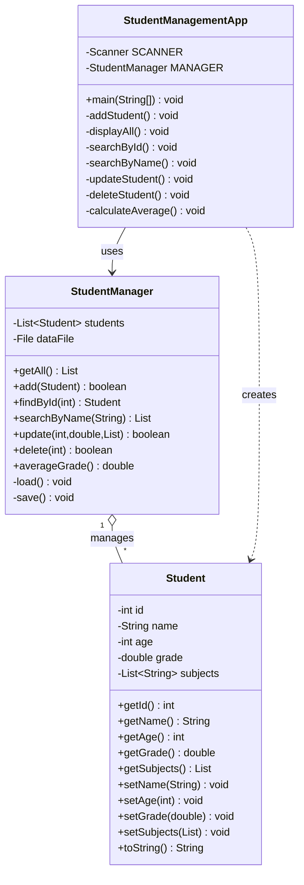

# Student Management System – UML Class Diagram

```mermaid
classDiagram
    class Student {
        -int id
        -String name
        -int age
        -double grade
        -List~String~ subjects
        +getId() int
        +getName() String
        +getAge() int
        +getGrade() double
        +getSubjects() List
        +setName(String) void
        +setAge(int) void
        +setGrade(double) void
        +setSubjects(List) void
        +toString() String
    }

    class StudentManager {
        -List~Student~ students
        -File dataFile
        +getAll() List
        +add(Student) boolean
        +findById(int) Student
        +searchByName(String) List
        +update(int,double,List) boolean
        +delete(int) boolean
        +averageGrade() double
        -load() void
        -save() void
    }

    class StudentManagementApp {
        -Scanner SCANNER
        -StudentManager MANAGER
        +main(String[]) void
        -addStudent() void
        -displayAll() void
        -searchById() void
        -searchByName() void
        -updateStudent() void
        -deleteStudent() void
        -calculateAverage() void
    }

    StudentManager "1" o-- "*" Student : manages
    StudentManagementApp --> StudentManager : uses
    StudentManagementApp ..> Student : creates
```

